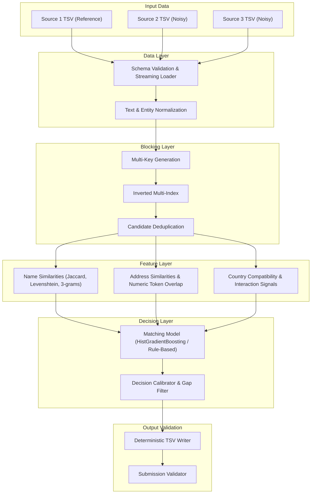

# EntityLink AI — System Architecture

## Overview

EntityLink AI is a modular, scalable machine learning system for cross-source business entity resolution, designed for the Amazon ML Challenge 2026. The system links heterogeneous, noisy business entities across three disjoint sources:
- **Source 1 ($S_1$):** Deduplicated reference entities.
- **Source 2 ($S_2$):** Noisy secondary records.
- **Source 3 ($S_3$):** Noisy tertiary records.

---

## Architectural Principles

1. **Clear Modular Boundaries:** Preprocessing, candidate generation, feature extraction, scoring, and output generation are decoupled. Any module can be updated independently without breaking downstream consumers.
2. **Open-Set Country Support:** Countries are treated dynamically as an open set of string labels rather than hard-coded categories, ensuring robust generalization to test countries (such as France) that do not appear in the training split.
3. **Strict Candidate Subset Invariant:** Every final match in `matching_results.tsv` is mathematically guaranteed to be a subset of `candidate_pairs.tsv`.
4. **Memory Efficiency & Streaming:** All source readers support streaming iteration to handle multi-gigabyte datasets without out-of-memory errors on commodity hardware.
5. **Deterministic Calibration:** Decision thresholds and confidence gaps are tuned specifically for the precision-heavy official metric ($F_{0.5}$).
